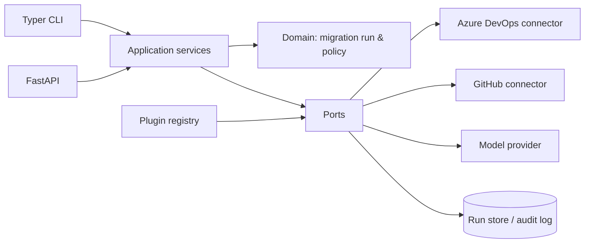

# Architecture

The platform uses a clean/hexagonal layout. External services are accessed only through ports; source and target connectors, model providers, storage, and plugins are replaceable adapters.

## Scope boundary

A `MigrationRequest` contains exactly one ADO organization/project/repository and one GitHub organization/repository. Project-wide resources are not implicitly migrated. Shared resources can be analyzed and reported as dependencies, then migrated through a separately approved repository run.

## Run lifecycle

`DISCOVERING → ANALYZED → PLANNED → MIGRATING → VALIDATING → COMPLETED`

`FAILED`, `ROLLED_BACK`, and `CANCELLED` are terminal states. State transitions are validated by the domain model and every action must emit an audit event. Remote writes require an approved, non-dry-run plan.

## Persistence schema

| Entity | Key fields |
| --- | --- |
| `migration_runs` | id, source, target, status, dry_run, created_at |
| `migration_plans` | run_id, version, approved_by, approval_time, content_hash |
| `audit_events` | id, run_id, action, actor, outcome, occurred_at, metadata |
| `asset_mappings` | run_id, source_type/id, target_type/id, status |
| `validation_results` | run_id, check, expected, actual, outcome |

Use PostgreSQL in production; SQLite is suitable only for local development.
